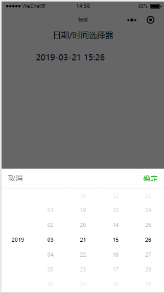

# wepy-dateTimePicker

> wepy 日期/时间选择器，精确到分



## 安装 Install

> npm i wepy-datetimepicker

## 使用 Usage

```js
import DateTimePicker from 'wepy-datetimepicker'

export ...
    data = {
      minutes:30 //初始化30分钟后的时间
    }
    components = {
        DateTimePicker: DateTimePicker
    }
```

```vue
   <DateTimePicker :date="date" name="date" :minutes="minutes"/>
   // {{date}} 查看选到的值
```

## 配置 Options

### Api

| 参数      | 说明             | 类型       | 可选值  | 默认值             |
| ------- | -------------- | -------- | ---- | --------------- |
| date    | 传进来的日期         | [String] | 必填   | 2019-3-21 15:01 |
| name    | form 提交时定义name | [String] | 可不填  | dateTimePicker  |
| minutes | 初始化时候时间        | [Number] | 可不填  | 0               |
